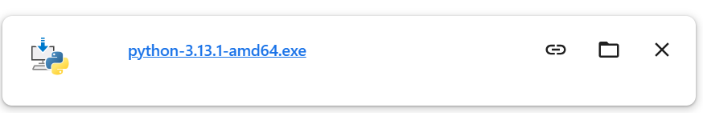
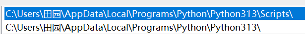
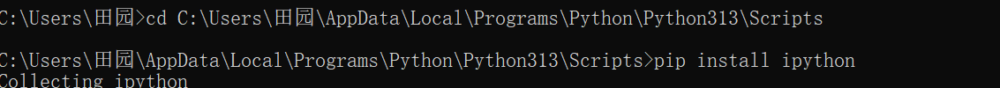
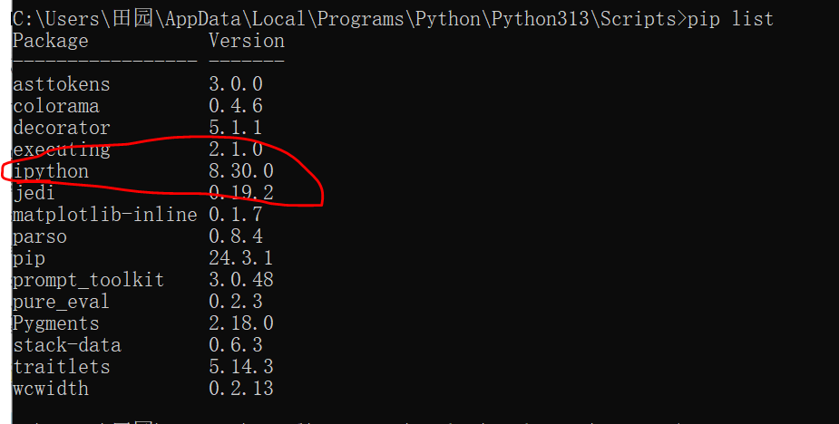
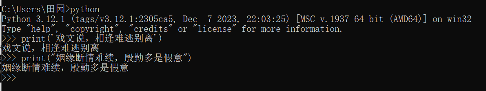
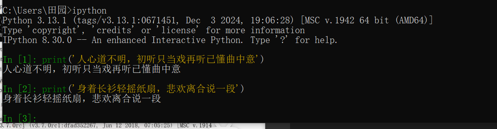

## PYTHON
## 一、PYTHON环境的安装
* 1.1 下载PYTHON
    * 去官网找，下载符合电脑的。官网：https://www.python.org/
* 1.2 安装
    * 
    * 安装时，不选择自动安装，选择自定义安装，将pip等全部勾选后，点击next，并勾选**Add Python 3.x to Path**，也就是选中添加环境变量后，再继续安装。
* 1.3 测试是否安装成功
    * 在命令提示符，输入python，可查看版本，并查看是否安装成功。
* 1.4 手动配置Python
    * 若未按照上一个步骤进行，可手动配置。桌面上右键点击此电脑，点击属性，继续点击高级系统设置，点击环境变量，选中USER的用户变量中的Path后，点击编辑，再点击新建，填写好路径即可添加到下载python的盘中。记得点击三个确定。
## 二、pip的使用
* pip是一个现代的、通用的Python包管理工具。提供了对Python包的查找、下载、安装、卸载的功能，便于我们对Python的资源包进行管理。相当于学习前端时的npm和yarn。
* 2.1 安装
    * 安装Python是，会自动下载并安装pip。
* 2.2 配置
    * 在Windows命令行里，输入```pip -V```，即可查看pip版本。
        * 
    * 但若在命令行里，运行```pip -V```，出现如下提示：
        * 
    * 可能是因为在安装Python的过程中未勾选**Add Python 3.x to Path**选项的缘故，需要手动昂配置pip环境变量，具体步骤看一，只不过要正确输入路径，下面是我的路径。
        * 
* 2.3 使用pip管理Python包
    * pip install <包名>：安装指定的包，包大还是包小，等一会儿出现Successfully installed巴拉巴拉，即意味着安装成功。前提是没有输错字母。
        * 
    * pip uninstall <包名>：卸载/删除指定的包
    * pip list ：显示已经安装的包，可查看已安装成功的包。
        * 
    * pip freeze：显示已经安装的包，并以指定的格式显示，会把依赖的第三方也给展示出来。
* 2.4 修改pip下载源
    *   运行pip install命令会从网站上下载指定的python包，默认是从https://files.pythonhosted.org/ 网站上下载。这是国外的网站，遇到网络不稳定的情况时，可能会下载失败，因此可以通过命令，修改pip现在软件时的源。
    * 格式： ```pip install 包名 -i 国内源地址```(这个-绝对不能省略)
    * 示例：
        * ```pip install ipython -i https://pypi.mirrors.ustc.edu.cn/simple/```，就是从中国科技大学(ustc)的服务器上下载requests(给予python的第三番文本框架)
    * 国内常用的pip下载源列表：
        * 阿里云：https://mirrors.aliyun.com/pypi/simple/
        * 中国科技大学：https://pypi.mirrors.ustc.edu.cn/simple/
        * 豆瓣：https://pypi.douban.com/simple/  (老师推荐使用)
        * 清华大学：https://pypi.tuna.tsinghua.edu.cn/simple/
        * 中国科学技术大学：https://pypi.mirrors.ustc.edu.cn/simple/
## 三、运行Python程序
* 3.1 终端运行
    * 1. 直接在python解析器中书写代码，缺点是无法保存到本地或硬盘中。
        * 
        * 如何退出python环境，就是上面那个环境
            * 1. exit()
            * 2. Ctrl+z
    * 2. 使用ipython解析器编写代码
        * 使用pip命令，可以快速安装ipython，不要写在python根目录下，直接在当前目录编写即可。但这两种方法有个共同的缺点，就是无法保存文件到本地或硬盘当中，不利于二次开发。
            * ```pip install ipython -i https://pypi.douban.com/simple```
            * 成功安装ipython后，在当前目录下输入ipython进入ipython的环境中，即可编写代码。
            * 
* 3.2 运行python文件
* 3.3 Pycharm(最常用)
* 3.4 Pycharm的使用介绍 
## 四、Python

